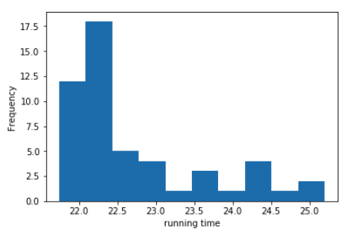
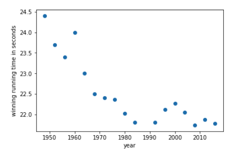

## Get the data
Read or open the csv. In spreadsheets fix the first row as the header. **How many rows are in the csv?**

Google sheets 

* use `file` > `import`… to import the CSV
* highlight the first row, then go to `view` > `Freeze` > `1 row`

Excel

* To fix the header row highlight the first row, go to tab `view` > `Freeze Top Row`

Python

* use Pandas to read in the CSV as a dataframe
* First import libraries:
 ```
        import pandas as pd
        import matplotlib.pyplot as plt
```
* Then use `pd.read_csv`


_points_: 5

**Flag**

_flag_: `51`

_flag type_: static


## Average Fastness
What’s the mean running time across all rows? Enter the number rounded to the precision of 1 decimal place.

_points_: 5

_requirement_: Get the data

**Flag**

_flag_: `22.7`

_flag type_: static


## Merlene OTTEY
Filter to runner with name 'Merlene OTTEY'. What are their fastest and slowest race times? Enter numbers separated by a comma rounded to 1 decimal place. E.g. 10.1,11.1

Google sheets

* use the `FILTER` command to get the filtered rows in another column. You could also just highlight and count but the `FILTER` command will come in handy later, so we recommend using trying it.

Excel

* There is no `FILTER` command. Some ways to do this is to create a filter view or add sorting under `Home` > `Sort & Filter` 

Python

* If the data frame is called `df` you can filter it like so `df[df[‘Name’] ==  'Merlene OTTEY']`


_points_: 5

_requirement_: Average Fastness

**Flag**

_flag_: `\s*22.1\s*,\s*22.2\s*`

_flag type_: regex


## Merlene OTTEY average time
How many seconds less is Merlene OTTEY’s average race time compared to the average race time for all other runners? The average race time for all other runners should *not* include Merlene's times. Enter the number rounded to 2 decimal places.

Caution: If you’re using a filtered view on a spreadsheet, applying a function on the column applies the function to all rows, even ones not showing. 

Google sheets:

* `FILTER` comes in handy now because it can be the input to another function. That is we can do `=AVG(FILTER(<parameters>))` to first filter based on some condition and compute the mean on those filtered rows

Excel

* There is no convenient filter function you can use as input to another. There is however the `AGGREGATE` function with an option to compute an aggregation function only on visible rows.
* `AGGREGATE` takes a number as its first argument. Use `1` to use the AVERAGE function. The second argument determine values to ignore. Use `5` to ignore hidden rows. The third argument is the data range, so choose the `Result` column for this.


_points_: 5

_requirement_: Merlene OTTEY

**Flag**

_flag_: `0.62`

_flag type_: static


## Group by
Across all years, which nationalities are tied for winning the most medals? We want you to try to use a “group by” operation to group by each nationality and count the number of rows.
Enter comma separated values of the nationalities, sorted alphabetically, with no space after the comma. E.g. AUS,GBR

Google sheets

* We’re going to use a pivot table for the group by operation. Highlight the `Nationality` column and go to tab `Data` > `Pivot Table...`. You want to create a pivot table in a new sheet.
* In the `Pivot table editor` pane on the right
	* Under `Rows` click `Add` and pick `Nationality`
	* Under `Values` click `Add` and pick `Nationality`. It should automatically show you the `COUNTA of Nationality`

Excel

* We’re going to use a pivot table for the group by operation. Highlight the `Nationality` column and go to tab `Insert` > `PivotTable`. Create it in a new sheet.
* On the right you should see the `PivotTable` fields. Under `Field Name`, drag `Nationality` to the `Rows` box. Then drag `Nationality` to the `Values` box.
* The `Values` should be the count of `Nationality`

Python
* Use `df.groupby`


_points_: 10

_requirement_: Merlene OTTEY average time

**Flag**

_flag_: `\s*JAM\s*,\s*USA\s*`

_flag type_: regex


## Histogram
Plot a histogram of the race times. This bins the times and counts the number of values we see in each bin. It should look something like the image attached. Since this is for teaching purposes we’ll take your word for capturing this flag. Once you create the plot use the flag `histobistro`. Why do you think the histogram looks this way?

Google sheets

* Highlight the `Result` column. Go to the tab `Insert` >`Chart`. It should automatically be a histogram. If not change the chart type in `Chart Editor` to `Histogram Chart`

Excel

 * Highlight the `Result` column, On the `Insert` tab choose the icon that looks like a histogram and click the histogram icon

Python

* You can use `matplotlib.pyplot` directly: `plt.hist(df[‘Result’])`. Or you can call plot on the dataframe which calls `matplotlib` internally: `df.plot(y=’Result’, kind='hist')`.


_points_: 5

_requirement_: Group by

**Flag**

_flag_: `histobistro`

_flag type_: static

**Attached Image**




## Scatter plot
Plot winning race time vs year on a scatter plot. The winning race time is the fastest time for that year. You’ll need to use a group by operation to find the winning time for each year, then make a plot with this data. What kind of trend do you see?

It should look something like the image attached. Again we’ll take your word for capturing this flag. Once you create the plot use the flag `varyingvariance`. (5 points)

Google sheets

* Highlight the entire sheet and create a pivot table. Use the pivot table to find the winning time for each year.
* Highlight the years and winning times and create a chart. Click on the chart to open the `Chart Editor`
* Go to the `Setup` tab. Change the `Chart Type` to `Scatter chart`
* Optional: in `Customize` > `Vertical axis` add a min value to make the points easier to see.

Excel

* Highlight the entire sheet and create a pivot table. Use the pivot table to find the winning time for each year
* Highlight the years and winning times and create a scatter plot. You may have to copy the data to a new sheet to plot it.

Python

* Use `df.groupby` first to find the winning times. Then use something like `plt.scatter` to plot winning race time vs year


_points_: 10

_requirement_: Histogram

**Flag**

_flag_: `varyingvariance`

_flag type_: static

**Attached Image**



