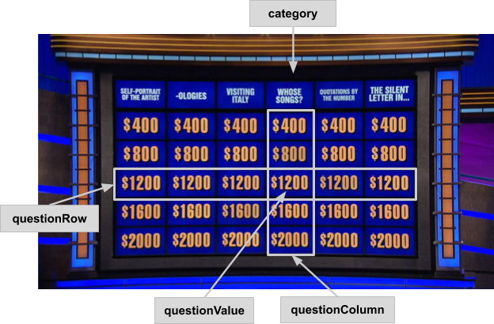

# Jeopardy!
This is James Holzhauer. James Holzhauer had a 32-game winning streak on the game show _Jeopardy!_. His playing style exploited several statistical patterns that gave him a big leg up over the other competitors. 

This challenge will be about uncovering repeated patterns and game styles emerging from the way participants have played _Jeopardy!_ over the years.

The dataset (`jeopardy.csv`) contains data scraped from [http://www.j-archive.com/](http://www.j-archive.com/), a fan website that contains data and statistics about each _Jeopardy!_ episode. We scraped the data using code from [here](https://github.com/jbovee/j-archive-parser), cleaned the data and kept only episodes between 2010 and 2019.

There are more than 100,000 rows in the dataset. Each row represents a different question asked during a _Jeopardy!_ episode.

The following columns are available:

* `airDate`: the date when the episode aired.
* `roundName`: either “Jeopardy” (the first round) or “Double Jeopardy” (second round, questions are twice as valuable).
* `category`: a string representing the question category.
* `questionRow`: the vertical position of the question on the board. Value increases going top  to bottom. A number between 1 and 5.
* `questionColumn`: the horizontal position of the question on the board. Value increases going left to right. A number between 1 and 6.
* `questionValue`: value (in dollars) of the question.
* `order`: the order in which the question was selected by a player (1 = first, 2 = second, etc.).
* `dailyDouble`: TRUE if the question is a “Daily Double”, FALSE otherwise.
* `attempts`: number of attempts to solve the clue. 0 means that the first person who buzzed solved it, 1 means the second person who buzzed solved it, and so on.
* `positionOfEpisodeWinner`: the position on the podium of the episode winner. Valid values are “left”, “middle”, “right”, or “n/a”.
