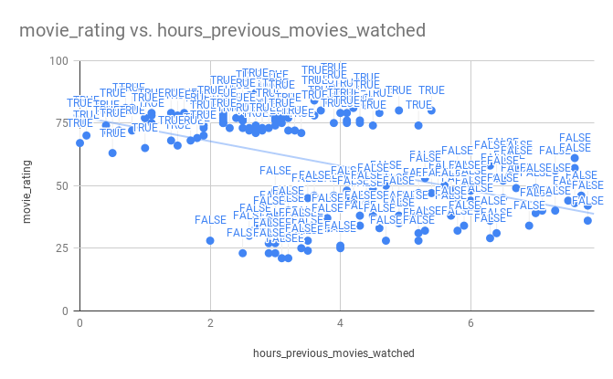

## Correlate the young
`hours_previous_movies_watched` is the number of hours a viewer has watched superhero movies in the past month, and `movie_rating` is the viewer's rating of a current superhero movie.

For viewers with age <= 50, what is the correlation between `hours_previous_movies_watched` and `movie_rating`? Enter the number rounded to the precision of 2 decimal places.

Hint:

* In spreadsheets: use the `CORREL` function. Remember functions like `CORREL` don’t respect filtered views on the data. Instead you can use the `FILTER` function as input to `CORREL`

_points_: 20

**Flag**

_flag_: `0.40`

_flag type_: static

_flag_: `.40`

_flag type_: static

## Correlate the not so young
For viewers with age > 50. What is the correlation between `hours_previous_movies_watched` and `movie_rating`? Enter the number rounded to the precision of 2 decimal places.

_points_: 15

_requirement_: Correlate the young

**Flag**

_flag_: `0.58`

_flag type_: static

_flag_: `.58`

_flag type_: static

## Correlate all hours
Compute the correlation coefficient between `hours_previous_movies_watched` and `movie_rating` on all rows. Enter the number rounded to the precision of 2 decimal places.

_points_: 15

_requirement_: Correlate the not so young

**Flag**

_flag_: `-0.47`

_flag type_: static

_flag_: `-.47`

_flag type_: static

## Correlate age
That seems weird. Correlation is positive when computed on the below and above 50 year old groups separately, but the relationship reverses when looking at all viewers. This could happen when there is another variable influencing the ratings (a confounding variable). What’s the correlation coefficient between `age` and `movie_rating`? Enter the number rounded to the precision of 2 decimal places.

_points_: 15

_requirement_: Correlate all hours

**Flag**

_flag_: `-0.96`

_flag type_: static

_flag_: `-.96`

_flag type_: static

## Plot relationships
Looks like age strongly influences a viewer’s rating of the superhero movie. A plot might help us understand how both variables affect `movie_rating`. Plot `hours_previous_movies_watched` vs `movie_rating` on a scatter plot, and make the color or label of each point indicate whether the `age` is <=50 or > 50. Optional: add a trendline.

Does it make more sense why the correlations overall reverses when looking in aggregate? What would we conclude from the data if we didn't have data on viewers' `age`?

This is called Simpson’s paradox. Look it up to learn more about it. To get this flag find a facilitator, show them your plot, and explain why we get the weird correlation flip. 

_points_: 50

_requirement_: Correlate age

**Flag**

_flag_: `thanos4lyfe`

_flag type_: static

**Hint**

_hint_: To label points, you might want to create an extra column indicating whether age is <= 50 or > 50 for each row. 

In Excel: To plot points in different colors you can add each set of points as a different data series to the plot.

_cost_: 2.0

**Capture Criteria for Facilitator**

There are three variables: age, # hours the viewer watched superhero movies prior to the current movie, and their rating of the current movie.

Participant should plot `movie_rating` vs `hours_previous_movies_watched`. It should look somewhat like this:

There should be two clusters labeled or colored by whether the user is above of below 50 years old. The general trend should be `movie_rating` is negatively correlated with `hours_previous_movies_watched`.

Note: You can try to guide the participant to the right explanation of the correlation flip if it seems like they’re close. You want them to realize the overall correlation between `hours_previous_movies_watched ` and `movie_rating ` is negative because of the confounding variable `age`. If we don’t take account for `age` we would wrongfully conclude that `hours_previous_movies_watched ` leads to lower `movie_rating ` when in fact the opposite is true.

In Google Sheets:

* Create a boolean column for whether the viewer is below or above 50 years old.
* Highlight `movie_rating ` and `hours_previous_movies_watched `, and create a chart. Change the chart type to “scatter”
* Under the `series` `movie_rating ` click `Add label` and add the boolean column. You should see a plot like above without the trendline. I have not been able to find a way to color the points by the boolean column. It’s a perfectly acceptable answer to label the points by the boolean values.
* (Optional) add a trendline. In the Chart editor go to “Customize” > “Series” and check “Trendline”. 

